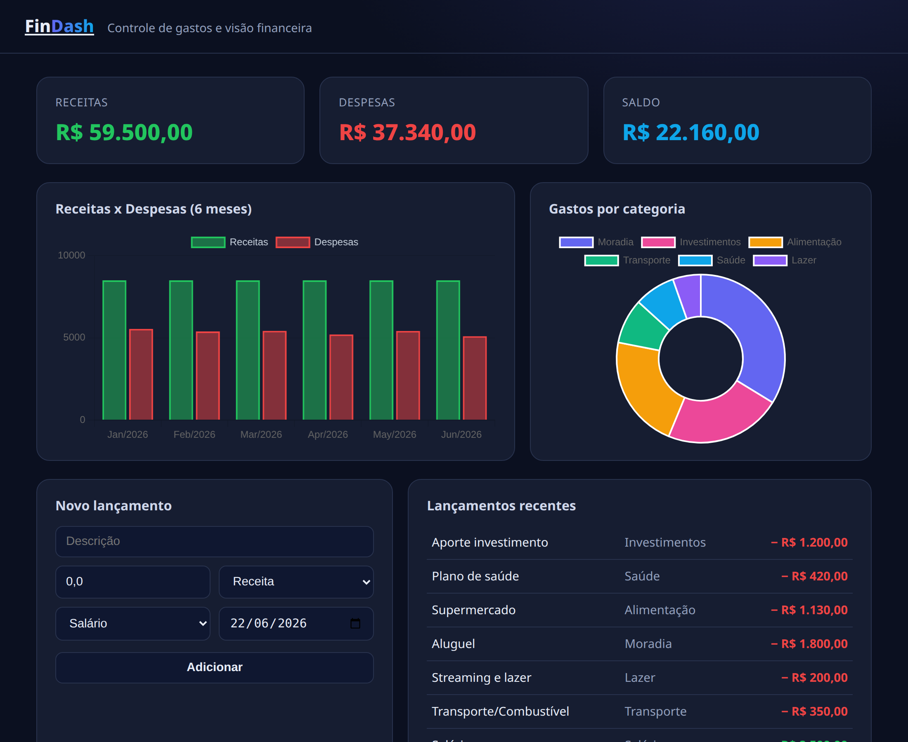

<div align="center">
  <h1>FinDash — Dashboard Financeiro</h1>
  <p><strong>Controle de gastos com categorias e gráficos, em Ruby on Rails 8.</strong></p>
</div>

<div align="center">
  
</div>

---

## Visão geral

Um painel de finanças pessoais: registra receitas e despesas por categoria e mostra a
saúde financeira em **cartões de resumo** e **gráficos**. O destaque é a **modelagem de
dados** e a **visualização** — as agregações ficam no modelo, e a interface só consome o
resultado. Visualmente forte, ideal para portfólio.

## O que demonstra

- **Agregações no modelo** — totais, saldo, gastos por categoria e resumo mensal são
  métodos de classe em `Transaction` ([app/models/transaction.rb](app/models/transaction.rb)),
  usando `group(...).sum(...)` do Active Record (cálculo no banco, não em Ruby).
- **Dinheiro em centavos** — valores guardados como inteiros (`amount_cents`), formatados
  para BRL em um único lugar.
- **Visualização** — gráfico de barras (receitas × despesas nos últimos 6 meses) e
  donut (gastos por categoria) com Chartkick + Chart.js.

## Funcionalidades

- Cartões de resumo: receitas, despesas e saldo
- Gráfico de barras de receitas × despesas por mês
- Gráfico de rosca de gastos por categoria (ordenado do maior para o menor)
- Lançamento rápido de receitas/despesas
- Lista dos lançamentos recentes

## Como rodar

```bash
git clone https://github.com/Dudainfinity/findash.git
cd findash
bundle install
bin/rails db:prepare db:seed   # gera 6 meses de lançamentos de exemplo
bin/rails server
```

Acesse `http://localhost:3000`.

## Testes

```bash
bin/rails test
```

Cobrem as validações e, principalmente, as **agregações**: totais e saldo, gastos por
categoria (com ordenação), resumo mensal (quantidade de meses e valores) e a formatação
em BRL.

## Stack

| Camada      | Tecnologia                  |
|-------------|-----------------------------|
| Framework   | Ruby on Rails 8.1           |
| Gráficos    | Chartkick + Chart.js        |
| Banco       | SQLite                      |
| Testes      | Minitest                    |

---

Desenvolvido por [Dudainfinity](https://github.com/Dudainfinity).
